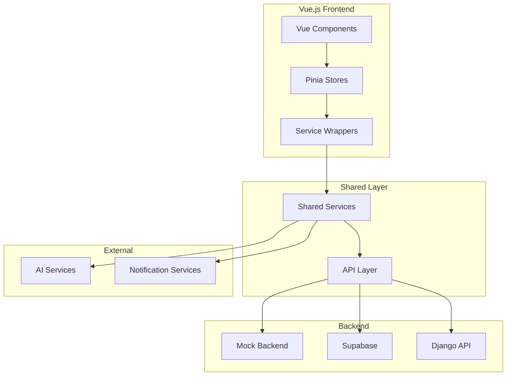

# Design Document

## Overview

این مستند طراحی کامل پیاده‌سازی نسخه جدید واسط کاربری Vue.js برای اپلیکیشن مدیریت خودرو (KhodroBan) را ارائه می‌دهد. این طراحی بر اساس معماری Service Layer Pattern و استفاده از سرویس‌های اشتراکی موجود استوار است.

## Architecture

### High-Level Architecture



### Data Flow Pattern

1. **User Interaction** → Vue Component
2. **Component** → Pinia Store (Action)
3. **Store** → Service Wrapper
4. **Service Wrapper** → Shared Service
5. **Shared Service** → API/Backend
6. **Response** → Store (State Update)
7. **Store** → Component (Reactive Update)

### Layer Responsibilities

- **Vue Components**: UI rendering, user interactions, local component state
- **Pinia Stores**: Application state management, business logic coordination
- **Service Wrappers**: Framework-specific adaptations, error handling
- **Shared Services**: Business logic, API communication, data transformation
- **API Layer**: HTTP communication, authentication, error handling

## Components and Interfaces

### Core Vue Components

#### 1. Layout Components

```typescript
// BaseLayout.vue
interface BaseLayoutProps {
  showSidebar: boolean;
  showHeader: boolean;
  loading?: boolean;
}

// Sidebar.vue
interface SidebarProps {
  collapsed: boolean;
  menuItems: MenuItem[];
  activeRoute: string;
}

// Header.vue
interface HeaderProps {
  user: User | null;
  notifications: Notification[];
  showNotifications: boolean;
}
```

#### 2. Feature Components

```typescript
// VehicleCard.vue
interface VehicleCardProps {
  vehicle: Vehicle;
  showActions: boolean;
  compact?: boolean;
}

// ServiceForm.vue
interface ServiceFormProps {
  vehicleId: string;
  initialData?: Partial<ServiceFormData>;
  mode: 'create' | 'edit';
}

// ReminderItem.vue
interface ReminderItemProps {
  reminder: Reminder;
  showActions: boolean;
  onDismiss: (id: string) => void;
}
```

#### 3. UI Components

```typescript
// LoadingSpinner.vue
interface LoadingSpinnerProps {
  size: 'sm' | 'md' | 'lg';
  color?: string;
}

// Toast.vue
interface ToastProps {
  message: string;
  type: 'success' | 'error' | 'warning' | 'info';
  duration?: number;
}

// Modal.vue
interface ModalProps {
  show: boolean;
  title: string;
  size: 'sm' | 'md' | 'lg' | 'xl';
}
```

### Pinia Stores

#### 1. Auth Store

```typescript
interface AuthStore {
  // State
  user: User | null;
  token: string | null;
  isLoading: boolean;
  error: string | null;
  
  // Getters
  isAuthenticated: boolean;
  userTier: 'free' | 'pro' | 'pro+';
  
  // Actions
  login(credentials: LoginCredentials): Promise<void>;
  register(data: RegisterData): Promise<void>;
  logout(): Promise<void>;
  refreshToken(): Promise<void>;
  updateProfile(data: Partial<User>): Promise<void>;
}
```

#### 2. Vehicle Store

```typescript
interface VehicleStore {
  // State
  vehicles: Vehicle[];
  selectedVehicle: Vehicle | null;
  isLoading: boolean;
  error: string | null;
  
  // Getters
  vehicleCount: number;
  vehicleById: (id: string) => Vehicle | undefined;
  
  // Actions
  fetchVehicles(): Promise<void>;
  createVehicle(data: VehicleFormData): Promise<Vehicle>;
  updateVehicle(id: string, data: Partial<VehicleFormData>): Promise<Vehicle>;
  deleteVehicle(id: string): Promise<void>;
  selectVehicle(id: string): void;
}
```

#### 3. Service Store

```typescript
interface ServiceStore {
  // State
  services: ServiceRecord[];
  isLoading: boolean;
  error: string | null;
  
  // Getters
  servicesByVehicle: (vehicleId: string) => ServiceRecord[];
  recentServices: ServiceRecord[];
  totalServiceCost: number;
  
  // Actions
  fetchServices(vehicleId?: string): Promise<void>;
  createService(data: ServiceFormData): Promise<ServiceRecord>;
  updateService(id: string, data: Partial<ServiceFormData>): Promise<ServiceRecord>;
  deleteService(id: string): Promise<void>;
}
```

#### 4. UI Store

```typescript
interface UIStore {
  // State
  sidebarCollapsed: boolean;
  theme: 'light' | 'dark';
  toasts: Toast[];
  modals: Modal[];
  
  // Actions
  toggleSidebar(): void;
  setTheme(theme: 'light' | 'dark'): void;
  showToast(toast: Omit<Toast, 'id'>): void;
  hideToast(id: string): void;
  showModal(modal: Omit<Modal, 'id'>): void;
  hideModal(id: string): void;
}
```

### Service Wrappers

```typescript
// src/services/vehicleService.js
import { vehicleService as sharedVehicleService } from '@services';

export const vehicleService = {
  async getAll() {
    try {
      return await sharedVehicleService.getAll();
    } catch (error) {
      throw new Error(`خطا در دریافت خودروها: ${error.message}`);
    }
  },
  
  async create(data) {
    try {
      return await sharedVehicleService.create(data);
    } catch (error) {
      throw new Error(`خطا در ایجاد خودرو: ${error.message}`);
    }
  }
};
```

### Router Configuration

```typescript
// src/router/index.js
const routes = [
  {
    path: '/',
    component: BaseLayout,
    meta: { requiresAuth: true },
    children: [
      { path: '', name: 'dashboard', component: DashboardView },
      { path: 'vehicles', name: 'vehicles', component: VehicleListView },
      { path: 'vehicles/:id', name: 'vehicle-details', component: VehicleDetailsView },
      { path: 'services', name: 'services', component: ServiceListView },
      { path: 'services/add', name: 'add-service', component: AddServiceView },
      { path: 'expenses', name: 'expenses', component: ExpenseListView },
      { path: 'reminders', name: 'reminders', component: RemindersView },
      { path: 'reports', name: 'reports', component: ReportsView },
      { path: 'settings', name: 'settings', component: SettingsView },
      { path: 'upgrade', name: 'upgrade', component: UpgradeView },
      { path: 'smart-advisor', name: 'smart-advisor', component: SmartAdvisorView }
    ]
  },
  {
    path: '/auth',
    component: AuthLayout,
    children: [
      { path: 'login', name: 'login', component: LoginView },
      { path: 'register', name: 'register', component: RegisterView }
    ]
  }
];
```

## Data Models

### Frontend-Specific Models

```typescript
// UI State Models
interface Toast {
  id: string;
  message: string;
  type: 'success' | 'error' | 'warning' | 'info';
  duration: number;
  visible: boolean;
}

interface Modal {
  id: string;
  component: string;
  props: Record<string, any>;
  visible: boolean;
}

interface NavigationItem {
  path: string;
  label: string;
  icon: string;
  badge?: number;
  children?: NavigationItem[];
}

// Form Models
interface VehicleFormState {
  data: VehicleFormData;
  errors: Record<string, string>;
  isSubmitting: boolean;
  isDirty: boolean;
}

interface ServiceFormState {
  data: ServiceFormData;
  errors: Record<string, string>;
  isSubmitting: boolean;
  currentStep: number;
  selectedTypes: ServiceType[];
}
```

### Validation Schemas

```typescript
// Form Validation
const vehicleValidationSchema = {
  model: { required: true, minLength: 2 },
  year: { required: true, min: 1300, max: 1410 },
  plateNumber: { required: true, pattern: /^[0-9]{2}[A-Z]{1}[0-9]{3}[0-9]{2}$/ },
  currentKm: { required: true, min: 0 }
};

const serviceValidationSchema = {
  vehicleId: { required: true },
  date: { required: true },
  km: { required: true, min: 0 },
  cost: { required: true, min: 0 },
  types: { required: true, minLength: 1 }
};
```

## Error Handling

### Error Handler Configuration

```typescript
// src/services/index.js
import { setErrorHandlers } from '@services';

setErrorHandlers({
  onAuthError: (error) => {
    // Redirect to login
    router.push('/auth/login');
    uiStore.showToast({
      message: 'لطفا مجدداً وارد شوید',
      type: 'warning'
    });
  },
  
  onNetworkError: (error) => {
    uiStore.showToast({
      message: 'خطا در اتصال به سرور',
      type: 'error'
    });
  },
  
  onValidationError: (error) => {
    uiStore.showToast({
      message: error.message || 'داده‌های ورودی نامعتبر است',
      type: 'error'
    });
  }
});
```

### Store Error Handling Pattern

```typescript
// در هر store
async function fetchData() {
  isLoading.value = true;
  error.value = null;
  
  try {
    const data = await service.getData();
    items.value = data;
  } catch (err) {
    error.value = err.message;
    // Error handler خودکار Toast نمایش می‌دهد
    throw err;
  } finally {
    isLoading.value = false;
  }
}
```

## Correctness Properties

*A property is a characteristic or behavior that should hold true across all valid executions of a system-essentially, a formal statement about what the system should do. Properties serve as the bridge between human-readable specifications and machine-verifiable correctness guarantees.*

### Property 1: Authentication State Consistency
*For any* user authentication operation (login, logout, register), the Pinia auth store state should always reflect the correct authentication status and user information
**Validates: Requirements 1.1, 1.3, 1.5**

### Property 2: Navigation Guard Protection
*For any* unauthenticated user attempting to access protected routes, the navigation guard should redirect them to the login page
**Validates: Requirements 1.4**

### Property 3: Authentication Error Handling
*For any* invalid login credentials (malformed email, wrong password, empty fields), the system should display appropriate error messages without crashing
**Validates: Requirements 1.2**

### Property 4: Vehicle Data Consistency
*For any* vehicle management operation (create, update, delete), the vehicle store should maintain data consistency and reflect changes immediately
**Validates: Requirements 2.1, 2.3, 2.5**

### Property 5: Vehicle Navigation
*For any* existing vehicle in the system, clicking on it should navigate to the correct vehicle details page
**Validates: Requirements 2.4**

### Property 6: Service Type Form Display
*For any* valid service type selection, the system should display the appropriate form fields for that service type
**Validates: Requirements 3.2**

### Property 7: Service and Expense Creation
*For any* valid service or expense data, the system should successfully create the record through the appropriate service
**Validates: Requirements 3.3, 3.4**

### Property 8: Chronological Data Ordering
*For any* list of services, expenses, or reminders, the system should display them in chronological order (newest first)
**Validates: Requirements 3.5, 5.5**

### Property 9: Loading State Management
*For any* asynchronous operation (data fetching, form submission), the system should display appropriate loading indicators during the operation
**Validates: Requirements 3.6, 9.3**

### Property 10: Dashboard Data Aggregation
*For any* user with vehicles and data, the dashboard should display a summary of vehicles, recent services, and active reminders
**Validates: Requirements 4.1**

### Property 11: Report Filtering
*For any* valid report filter change, the system should update the displayed report data accordingly
**Validates: Requirements 4.2, 4.4**

### Property 12: Reminder Management
*For any* valid reminder data, the system should create, display, and manage reminders correctly through the reminder service
**Validates: Requirements 5.1, 5.2, 5.4**

### Property 13: Notification Triggering
*For any* reminder that reaches its due date, the system should trigger appropriate notifications through the notification service
**Validates: Requirements 5.3**

### Property 14: AI Service Integration
*For any* valid vehicle problem description, the system should process it through the AI service and display results
**Validates: Requirements 6.1, 6.2**

### Property 15: AI History Persistence
*For any* AI consultation session, the system should maintain a history of previous consultations
**Validates: Requirements 6.3**

### Property 16: AI Recommendation Conversion
*For any* AI recommendation that can be converted, the system should provide options to create services or reminders
**Validates: Requirements 6.4**

### Property 17: Profile Management
*For any* valid profile update, the system should save changes through the auth service and reflect them in the UI
**Validates: Requirements 7.1, 7.2, 7.4**

### Property 18: Notification Settings
*For any* notification setting change, the system should update preferences through the notification service
**Validates: Requirements 7.3**

### Property 19: Upgrade Process
*For any* successful payment completion, the system should update the user's account status through the upgrade service
**Validates: Requirements 8.2**

### Property 20: Pro Feature Access Control
*For any* Pro feature, the system should only display and allow access to users with Pro tier status
**Validates: Requirements 8.3, 8.4**

### Property 21: Responsive Design
*For any* viewport size (mobile, tablet, desktop), the application should display correctly and maintain functionality
**Validates: Requirements 9.1**

### Property 22: Lazy Loading Performance
*For any* heavy component, the system should implement lazy loading to improve initial page load performance
**Validates: Requirements 9.4**

### Property 23: Error Handling and User Feedback
*For any* error that occurs in the system, the error handler should manage it gracefully and display appropriate user feedback
**Validates: Requirements 9.5, 2.6**

### Property 24: Backend Flexibility
*For any* valid backend type configuration (mock, supabase, django), the system should connect to the appropriate backend and function correctly
**Validates: Requirements 10.1, 10.2, 10.3**

### Property 25: Backend Error Handling
*For any* backend unavailability or connection error, the system should display appropriate error messages
**Validates: Requirements 10.4**

## Testing Strategy

### Unit Testing

- **Components**: Vue Test Utils برای تست کامپوننت‌ها
- **Stores**: تست actions، getters و state mutations
- **Services**: تست service wrappers و error handling
- **Utils**: تست utility functions و validators

### Property-Based Testing

Property-based testing برای اعتبارسنجی رفتار کلی سیستم استفاده خواهد شد. از کتابخانه **fast-check** برای JavaScript استفاده می‌کنیم.

**تنظیمات Property Testing:**
- حداقل 100 تکرار برای هر property test
- هر property test باید با کامنت مربوط به property طراحی تگ شود
- فرمت تگ: **Feature: vue-frontend-implementation, Property {number}: {property_text}**

### Integration Testing

- **Router**: تست navigation و guards
- **Store Integration**: تست تعامل بین stores مختلف
- **Service Integration**: تست اتصال به shared services
- **E2E Flows**: تست فرآیندهای کامل کاربر

### Testing Configuration

```javascript
// vitest.config.js
export default {
  test: {
    environment: 'jsdom',
    setupFiles: ['./src/test/setup.js'],
    coverage: {
      reporter: ['text', 'html'],
      threshold: {
        global: {
          branches: 80,
          functions: 80,
          lines: 80,
          statements: 80
        }
      }
    }
  }
};
```